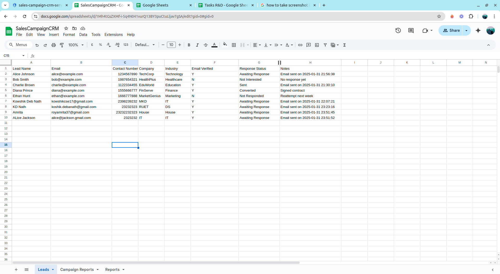
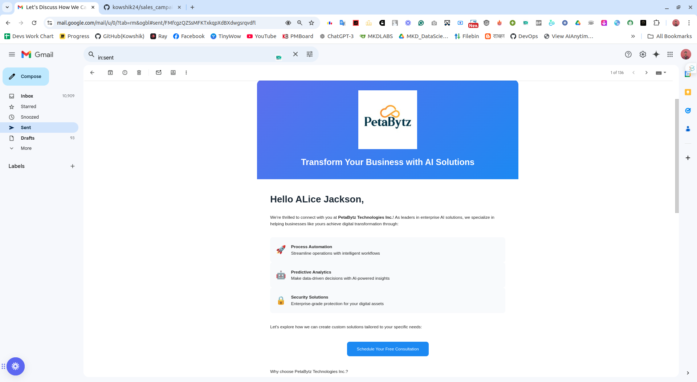
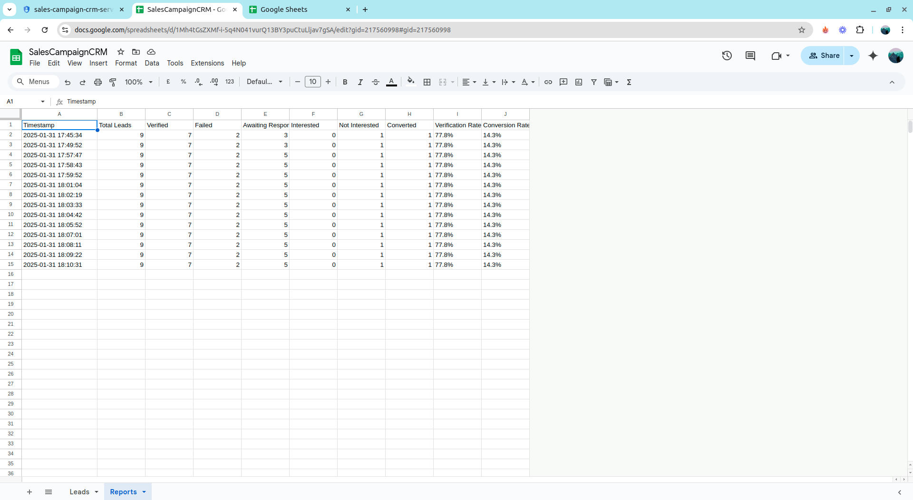

# Sales Campaign CRM

A automated sales campaign management system that handles email verification and outreach using Google Sheets.

## Prerequisites

- Python 3.10+
- Google Cloud Platform account
- Google Sheets API enabled
- Service Account with appropriate permissions
- SMTP server access for email sending

## Setup Instructions

1. Clone the repository:

```bash

git clone <repository-url>

cd sales_campaign_crm

```

2. Create and activate virtual environment:

```bash

python3.10 -m venv venv

source venv/bin/activate# Linux/Mac

# or

venv\Scripts\activate  # Windows

```

3. Install dependencies:

```bash

pip install -r requirements.txt

```

4. Set up Google Cloud Platform:

- Create a new project in Google Cloud Console
- Enable Google Sheets API
- Create a Service Account
- Download the service account key JSON file
- Share your Google Sheet with the service account email

5. Create .env file:

```bash

touch .env

```

6. Configure environment variables in .env:

```env

# Google Sheets Configuration(Take teh json file and upload into the root folder)

GOOGLE_SHEETS_CREDS_PATH=path/to/your/service-account-key.json
SENDER_EMAIL=your-email@gmail.com
EMAIL_PASSWORD=your-email-password

```

## Google Sheet Structure

Required columns in your Google Sheet:

1. Lead Name
2. Email
3. Company
4. Phone
5. Email Verified (Y/N/Pending)
6. Assigned To
7. Response Status
8. Notes

## Running the Application

1. Start the supervisor agent (manages overall workflow):

```bash

python supervisor_agent.py

```

2. Run email verification agent separately (optional):

```bash

python agent_a.py

```

3. Run email outreach agent separately (optional):

```bash

python agent_b.py

```

## Environment Variables Explained

### Google Sheets Configuration

-`GOOGLE_SHEETS_CREDS_PATH`: Path to your service account JSON file


### Email Configuration
- `SENDER_EMAIL`: Your email address

- `EMAIL_PASSWORD`: Your email password

## Notes

- Ensure your Google Sheet is shared with the service account email.
- The application will read from and write to the specified Google Sheet.
- The email verification and outreach agents will process leads based on the current state in the Google Sheet.
- The supervisor agent manages the overall workflow and ensures that leads are processed in the correct order.

## Results

Here are the screenshots showing the system in action:

### Google Sheet Dashboard
Shows the main Sales Campaign CRM spreadsheet with lead status:


### Email Responses
Shows sample email responses sent to leads:


### Report Logs
Shows the automated reporting dashboard:
